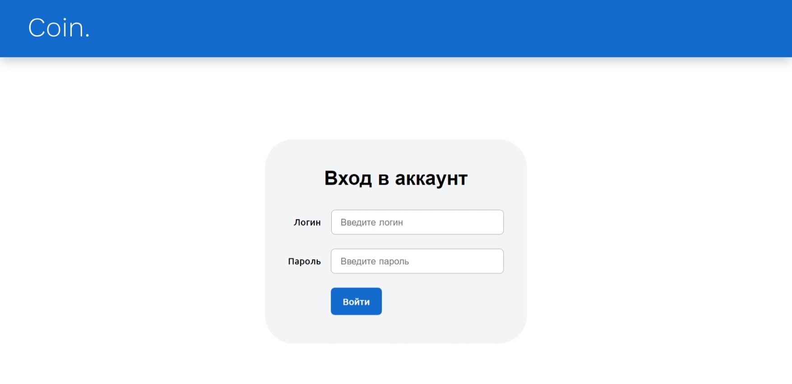
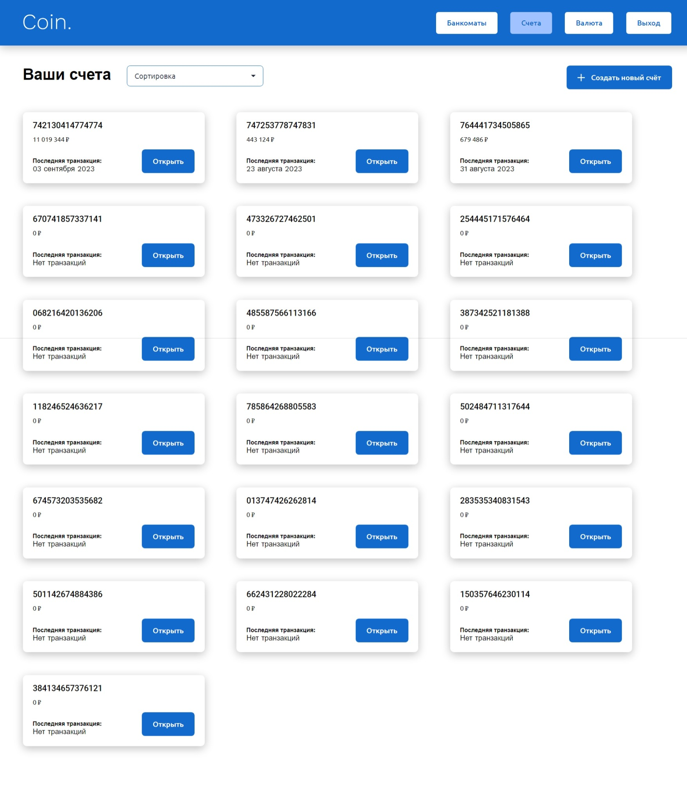
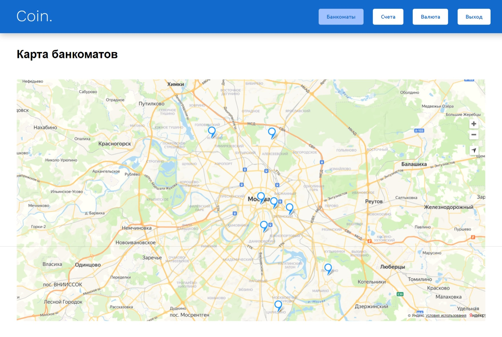
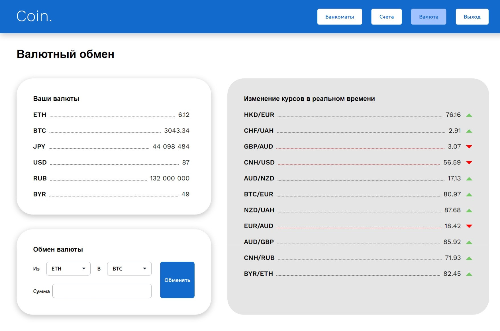
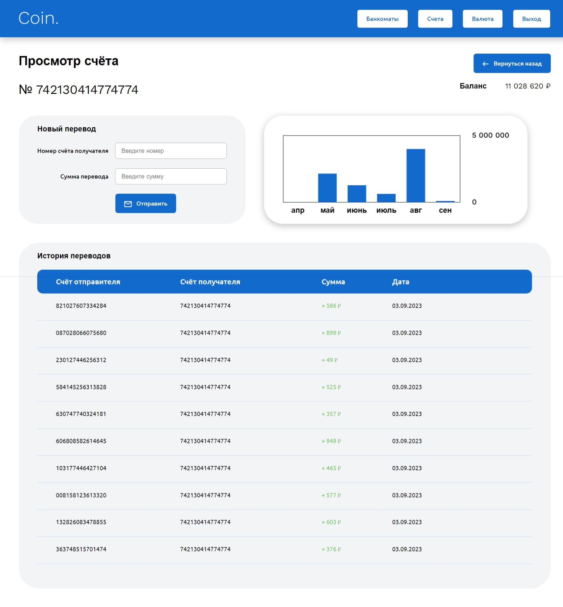

<h1 align="center">Bank</h1>

Cryptocurrency bank web application

## What is this web application for? 🤷‍♀️

This startup is an innovative project designed to bring together traditional banking and cryptocurrencies.

It will be the first bank in the market that openly and freely allow users to exchange and dispose of
cryptocurrencies on a par with other traditional currencies.

## Features

- Authorization of users
- Possibility to create an account
- Transferring funds from one account to another
- Viewing transaction history
- Ability to convert from one currency to another
- View ATM map

## Setting up development environment 🛠

- `git clone https://github.com/JackKerouac1613/bank.git`
- `npm install`
- `cd backend`
- `npm start`
- `npm run dev`
- App should now be running on `http://localhost:8080/`

## Running cypress end-to-end tests 🚥

- Set up development environment
- `npm run start`
- `npm run cypress` in another terminal
